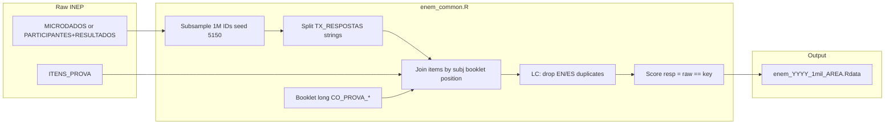

# Agent Handoff: ENEM for IRW

**Read this first** when continuing work on adding Brazilian ENEM data to the [Item Response Warehouse](https://itemresponsewarehouse.org/).

**Human contributor:** Mateus Mazzaferro (Stanford RA, summer 2025)  
**Handoff written:** 2025-06-30  
**Workspace:** `C:\Users\mmmaz\OneDrive\Stanford\IRW`

---

## 1. Mission

Add ENEM (Exame Nacional do Ensino M�dio) item-response data to IRW:

1. **Phase 1 (mostly done):** Process 2023 & 2024 microdata ? IRW-format tables, PR to `ben-domingue/irw`, Ben uploads to Redivis.
2. **Phase 2 (pilot done, scale pending):** Attach item text (Portuguese + English) via IRW_text; backfill 2013�2022.
3. **Phase 3 (docs drafted):** User-facing note on ENEM sparsity (#723); image strategy memo for Ben (#1403).

**GitHub issues:**

| Issue | Purpose |
|-------|---------|
| [#955](https://github.com/ben-domingue/irw/issues/955) | Add 2023 & 2024 data (priority, `data queue`) |
| [#723](https://github.com/ben-domingue/irw/issues/723) | Document LC foreign-language sparsity for users |
| [#1403](https://github.com/ben-domingue/irw/issues/1403) | Item text research / IRW_text infrastructure |

---

## 2. What is already done

### Response processing (Phase 1)

**Scripts** (not yet merged to upstream � live in local clone):

| File | Role |
|------|------|
| `irw/data/enem_common.R` | Shared logic (load, subsample, melt, score, save) |
| `irw/data/enem_2023.R` | Year 2023 driver |
| `irw/data/enem_2024.R` | Year 2024 driver (split microdata format) |

**Reference:** `irw/data/enem_2022.R` (pattern Ben's team used for 2013�2022).

**Outputs** (verified on disk 2025-06-30):

```
ENEM/output/
  enem_2023_1mil_lc.Rdata   (~24 MB)
  enem_2023_1mil_ch.Rdata   (~25 MB)
  enem_2023_1mil_cn.Rdata   (~25 MB)
  enem_2023_1mil_mt.Rdata   (~26 MB)
  enem_2024_1mil_lc.Rdata   (~20 MB)
  enem_2024_1mil_ch.Rdata   (~21 MB)
  enem_2024_1mil_cn.Rdata   (~21 MB)
  enem_2024_1mil_mt.Rdata   (~20 MB)
  enem_2023_run.log
  enem_2024_run.log
```

**QC summary** (from logs):

| Table | Rows | Unique IDs | Unique items | resp |
|-------|------|------------|--------------|------|
| enem_2023_1mil_lc | 40,000,000 | 1,000,000 | 82 | 0�1 |
| enem_2023_1mil_ch | 45,000,000 | 1,000,000 | 90 | 0�1 |
| enem_2023_1mil_cn | 45,000,000 | 1,000,000 | 93 | 0�1 |
| enem_2023_1mil_mt | 45,000,000 | 1,000,000 | 93 | 0�1 |
| enem_2024_1mil_lc | 41,345,105 | 1,000,000 | 42 | 0�1 |
| enem_2024_1mil_ch | 45,000,000 | 1,000,000 | 46 | 0�1 |
| enem_2024_1mil_cn | 45,000,000 | 1,000,000 | 93 | 0�1 |
| enem_2024_1mil_mt | 45,000,000 | 1,000,000 | 94 | 0�1 |

**Confirmed with Ben (issue #955):** 1M subsample, `set.seed(5150)`.

### Data on disk

| Path | Contents |
|------|----------|
| `ENEM/downloads/microdados_enem_2023.zip` | ~497 MB |
| `ENEM/downloads/microdados_enem_2024.zip` | ~710 MB |
| `ENEM/extracted_2023/DADOS/` | `MICRODADOS_ENEM_2023.csv`, `ITENS_PROVA_2023.csv` |
| `ENEM/extracted_2024/DADOS/` | `PARTICIPANTES_2024.csv`, `RESULTADOS_2024.csv`, `ITENS_PROVA_2024.csv` |
| `ENEM/PROVAS E GABARITOS/` | 2024 PDF cadernos + 2 DOSVOX `.txt` files |
| `ENEM/DADOS/` | Duplicate/partial 2024 files (also under extracted_2024) |

### Item text pilot (Phase 2 � partial)

| File | Status |
|------|--------|
| `ENEM/scripts/parse_dosvox.py` | Parses DOSVOX `.txt` ? `CO_ITEM` via `ITENS_PROVA` |
| `ENEM/scripts/build_enem_itemtext.py` | Splits master text into per-table `__items.csv` |
| `ENEM/scripts/backfill_enem_itemtext.py` | Inventory script for 2013�2022 provas |
| `ENEM/output/itemtext/enem_2024_1mil_*__items.csv` | 100% coverage for items in **2 LARANJA cadernos only** |
| `ENEM/output/itemtext/backfill_inventory.csv` | 2013�2022: no DOSVOX locally yet |

**Not done:** English translation (currently stub = copy of Portuguese); upload to Redivis `IRW_text`; PDF parsing for other booklet colors; backfill older years.

### Documentation drafts

| File | Use |
|------|-----|
| `irw-work-docs/ENEM_DATA_DICTIONARY_TEMPLATE.csv` | Paste into Google Sheet data dictionary |
| `irw-work-docs/ENEM_TAGS_TEMPLATE.csv` | Paste into tags sheet |
| `irw-work-docs/ENEM_ISSUE_955_COMMENT.md` | GitHub issue comment (stats filled in) |
| `irw-work-docs/ENEM_USER_NOTE_723.md` | User note on wide-matrix sparsity |
| `irw-work-docs/ENEM_IMAGE_STRATEGY.md` | Memo for Ben on images |
| `irw-work-docs/ENEM_PROJECT_LOG.md` | Running log (may have encoding glitches in headers) |
| `irw-work-docs/PROJECT_CONTEXT.md` | General IRW workspace context |

---

## 3. What is NOT done (your queue)

### Immediate (Phase 1 completion)

- [ ] **Git PR** to `https://github.com/ben-domingue/irw` adding `enem_common.R`, `enem_2023.R`, `enem_2024.R` under `data/`
- [ ] **Comment on #955** with PR link, attach or share `.Rdata` / sample CSV, tag Ben
- [ ] **Mateus pastes** data dictionary + tags rows from templates into Google Sheets ([dictionary](https://docs.google.com/spreadsheets/d/1nhPyvuAm3JO8c9oa1swPvQZghAvmnf4xlYgbvsFH99s/edit))
- [ ] **Ben uploads** to Redivis (Mateus typically does not have credentials)

### Phase 2 � Item text

- [ ] Download INEP provas/DOSVOX for **2023** and more **2024** booklet colors (not just LARANJA)
- [ ] Run `parse_dosvox.py` ? `build_enem_itemtext.py` per year
- [ ] **Portuguese QA** by native speaker; **English translation** (machine + spot-check � confirm policy with Ben)
- [ ] Validate with `irw/itemtext/join.R` pattern; upload via `irw/itemtext/upload.py` ? `bdomingu/IRW_text`
- [ ] Backfill 2013�2022 as provas become available (`backfill_enem_itemtext.py --inventory-only` to track)

### Phase 3 � Docs / fixes

- [ ] Publish ENEM user note (#723) on website or data dictionary `notes`
- [ ] Discuss image strategy with Ben (`ENEM_IMAGE_STRATEGY.md`)
- [ ] Optional: fix swapped CH/CN descriptions in some legacy tag rows (see `irw/tags/tagging_joao/labeled_results.csv`)

---

## 4. IRW ENEM schema (non-standard but intentional)

**Table names:** `enem_YYYY_1mil_{lc,ch,cn,mt}`

| Suffix | Area (Portuguese) | Day |
|--------|-------------------|-----|
| `lc` | Linguagens, C�digos e suas Tecnologias | 1 |
| `ch` | Ci�ncias Humanas | 1 (Q46�90) |
| `cn` | Ci�ncias da Natureza | 2 |
| `mt` | Matem�tica | 2 |

**Columns:**

```
id | item | resp | position | booklet
```

- `id` = `NU_INSCRICAO`
- `item` = `CO_ITEM` (INEP item ID)
- `resp` = 0/1 (incorrect/correct vs answer key)
- `position`, `booklet` = needed because matrix is sparse across forms

**Existing IRW tables:** `enem_2013_1mil_*` through `enem_2022_1mil_*` (40 tables on Redivis). Same schema, no item text.

---

## 5. Processing pipeline (how it works)



### Critical bug that was fixed

**Problem:** `pivot_longer` on response strings produced lowercase area codes in `subj` (`lc`, `ch`) but `booklets` used uppercase (`LC`, `CH`) from `CO_PROVA_LC` prefix stripping. Joins failed ? `item` was NA ? bad QC (`items=1`, `resp=Inf`).

**Fix:** In `enem_process_area()`, use `toupper(area_code)` in `separate()` column names:

```r
into = paste0("raw_", toupper(area_code), "_", pos_from:pos_to)
```

Do not revert this.

### 2024 format change

No single `MICRODADOS_ENEM_2024.csv`. Use `enem_load_microdata_split()`:

- `PARTICIPANTES_YYYY.csv` ? `NU_INSCRICAO` as `id`
- `RESULTADOS_YYYY.csv` ? response columns
- Row-aligned bind (equal row counts; verified)

### LC foreign-language duplicates (#723)

Questions 1�5 exist in English and Spanish. `enem_lc_duplicates()` drops `(subj, booklet, position)` rows with multiple items before join. Explains why LC has fewer rows than 45M and why wide matrices look sparse.

---

## 6. How to run

**Prerequisites:** R 4.5.1+ at `C:\Program Files\R\R-4.5.1\bin\Rscript.exe`, packages `tidyverse`, `vroom`.

```powershell
# Set paths (defaults are hardcoded in scripts for Mateus's machine � override via env)
$env:ENEM_DATA_DIR = "C:\Users\mmmaz\OneDrive\Stanford\IRW\ENEM\extracted_2023\DADOS"
$env:ENEM_OUT_DIR  = "C:\Users\mmmaz\OneDrive\Stanford\IRW\ENEM\output"

cd C:\Users\mmmaz\OneDrive\Stanford\IRW\irw\data
& "C:\Program Files\R\R-4.5.1\bin\Rscript.exe" enem_2023.R *> ..\..\ENEM\output\enem_2023_run.log
& "C:\Program Files\R\R-4.5.1\bin\Rscript.exe" enem_2024.R *> ..\..\ENEM\output\enem_2024_run.log
```

**Runtime:** ~50 min for 2023, ~20 min for 2024 on Mateus's laptop (sequential). Needs ~8�16 GB RAM during load.

**Validate:**

```powershell
& "C:\Program Files\R\R-4.5.1\bin\Rscript.exe" ..\..\ENEM\scripts\validate_enem_output.R
```

**Item text (2024 pilot):**

```powershell
python ENEM/scripts/parse_dosvox.py --year 2024 `
  --provas-dir "ENEM/PROVAS E GABARITOS" `
  --itens "ENEM/extracted_2024/DADOS/ITENS_PROVA_2024.csv" `
  --out "ENEM/output/itemtext/enem_2024_itemtext_master.csv"

python ENEM/scripts/build_enem_itemtext.py --year 2024 `
  --itemtext-csv "ENEM/output/itemtext/enem_2024_itemtext_master.csv" `
  --itens "ENEM/extracted_2024/DADOS/ITENS_PROVA_2024.csv" `
  --out-dir "ENEM/output/itemtext"
```

### Long-running jobs � progress monitoring

Always redirect stdout/stderr to a log file. Tail every 10�15 min:

```powershell
Get-Content ENEM\output\enem_2024_run.log -Tail 5
Get-ChildItem ENEM\output\*.Rdata | Select Name, Length, LastWriteTime
Get-Process Rscript -ErrorAction SilentlyContinue | Select Id, CPU, WS
```

Expect one summary line per area when each finishes, e.g. `enem_2024_1mil_lc.Rdata: rows=... ids=1,000,000 ...`.

---

## 7. Repo layout

```
IRW/                          # Workspace root
??? irw/                      # Cloned ben-domingue/irw
?   ??? data/
?   ?   ??? enem_2013.R � enem_2022.R   # Existing upstream scripts
?   ?   ??? enem_common.R              # NEW � shared
?   ?   ??? enem_2023.R                # NEW
?   ?   ??? enem_2024.R                # NEW
?   ??? itemtext/             # upload.py, join.R
?   ??? training/enem.R       # Example irw_fetch usage
??? ENEM/
?   ??? downloads/            # INEP zips
?   ??? extracted_2023/       # Extracted microdados
?   ??? extracted_2024/
?   ??? output/               # .Rdata + logs + itemtext/
?   ??? scripts/              # parse_dosvox, build_enem_itemtext, validate
?   ??? PROVAS E GABARITOS/   # PDFs + DOSVOX
??? irw-work-docs/            # All ENEM_* templates + this handoff
```

**Clone IRW if missing:**

```powershell
git clone https://github.com/ben-domingue/irw.git IRW/irw
```

---

## 8. IRW item text infrastructure

- Response tables: Redivis `item_response_warehouse`
- Item text: Redivis `bdomingu/IRW_text` (upload via `irw/itemtext/upload.py`, needs `REDIVIS_API_TOKEN` in `.env`)
- Precedent for bilingual columns in response CSV: `irw/data/bakumenko_2023_adyghe_values.py` (`item_text`, `item_text_translated`)
- Companion table naming: `{table_name}__items.csv` with columns `item | item_text | item_text_translated`
- Join validation: `irw/itemtext/join.R`

**2024 item text caveat:** Only 2 DOSVOX files (LARANJA day 1 & 2) were parsed. Coverage is 100% for items appearing in those cadernos but **not** all items in `ITENS_PROVA_2024` across all booklet colors. Need more prova files for full coverage.

---

## 9. Known gotchas

1. **OneDrive paths** � workspace is under OneDrive; large file ops can be slow. `la---` in `dir` output indicates reparse points / cloud files.
2. **Do not run 2023 and 2024 R scripts in parallel** � RAM exhaustion on weak machines.
3. **Samuel's draft in issue #955** had broken pipes in CH/CN/MT blocks and the lowercase `subj` bug � use `enem_common.R` instead.
4. **2024 IDs** � `PARTICIPANTES` and `RESULTADOS` are row-aligned, not joinable on `NU_SEQUENCIAL` vs `NU_INSCRICAO`.
5. **Table suffix vs tag descriptions** � some legacy tag rows swap CH/CN area names in free text; table suffixes `ch`/`cn` are correct.
6. **Scripts not committed** � `enem_2023.R`, `enem_2024.R`, `enem_common.R` exist only locally until PR is opened.
7. **`translate_stub` in parse_dosvox.py** � copies PT to EN; replace before claiming `item_text_provided: Yes` in tags.

---

## 10. External links

| Resource | URL |
|----------|-----|
| INEP microdados | https://www.gov.br/inep/pt-br/acesso-a-informacao/dados-abertos/microdados/enem |
| IRW data standard | https://itemresponsewarehouse.org/standard.html |
| IRW data dictionary (sheet) | https://docs.google.com/spreadsheets/d/1nhPyvuAm3JO8c9oa1swPvQZghAvmnf4xlYgbvsFH99s/edit |
| IRW on Redivis | https://redivis.com/datasets/as2e-cv7jb41fd/tables |
| gpt-4-enem (reference only) | https://github.com/piresramon/gpt-4-enem |
| Contact | itemresponsewarehouse@stanford.edu |

---

## 11. Suggested first actions for next agent

1. Read this file + `irw-work-docs/PROJECT_CONTEXT.md`.
2. Verify `ENEM/output/*.Rdata` exist and match log stats.
3. Open PR with the three new R scripts; do **not** commit multi-GB data files.
4. Help Mateus post #955 comment using `ENEM_ISSUE_955_COMMENT.md`.
5. Continue Phase 2: download more 2024/2023 provas, expand item text, get Ben's OK on translation/images.

---

## 12. Plan reference

Original phased plan lives at `.cursor/plans/enem_irw_project_7152782f.plan.md` (do not edit). This handoff supersedes it for execution status.
